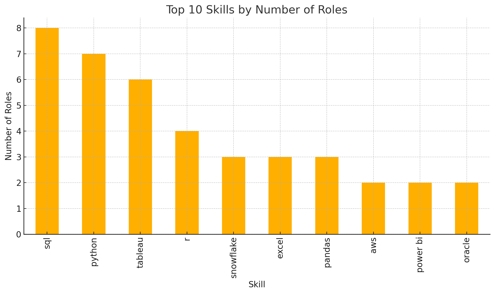
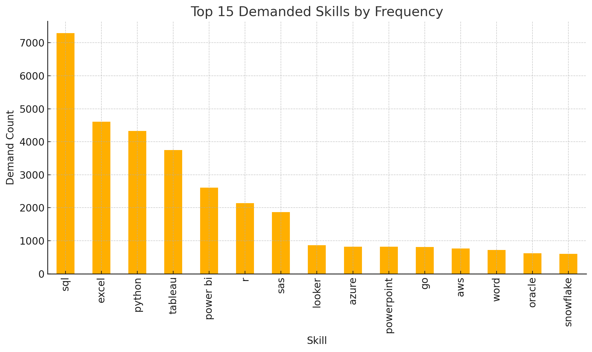
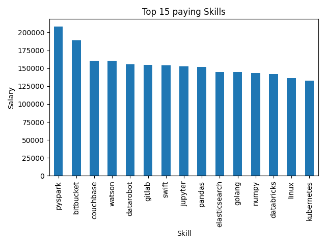
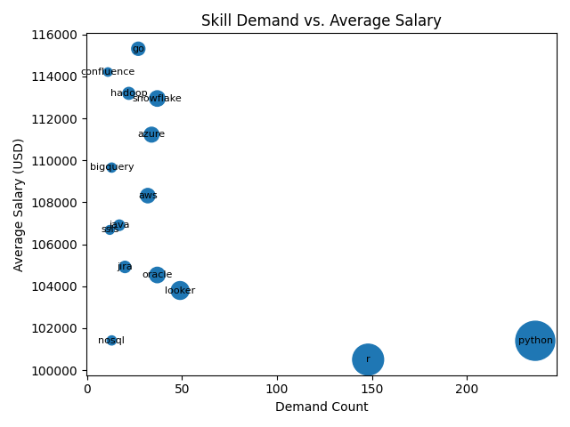

# Introduction
Diving into the data job market for 2023 focusing on data analyst roles, exploring top paying jobs, in-demand skills and where high demant meets high salary in data analytics


SQL queries? check them out here:
[project_sql folder](/project_sql/)

# Background
This is mostly for fun and to showcase some sql skills
The data was downloaded from [here](https://drive.google.com/drive/folders/1moeWYoUtUklJO6NJdWo9OV8zWjRn0rjN):

### The questions answered for each file were:
1. What are the top paying data analyst roles?
2. What skills are required for these top-paying jobs?
3. What skills are most in demand for data analysts?
4. Which skills are associated with higher salaries
5. What are the most optimal skills to learn


# Tools I Used

- **SQL**: To query the database
- **Python**: To create the visualization
- **PostgreSQL**: The Database management
- **Visual Studio Code**: For executing SQL queries
- **Git and Github**: Version control and sharing the SQL scripts and analysis

# The Analysis

Each query for this project investigated specific aspects of the job market (for 2023)
### 1. Top paying data analyst jobs
```sql
SELECT
    job_id,
    job_title,
    job_location,
    job_schedule_type,
    salary_year_avg,
    job_posted_date,
    name AS company_name
FROM
    job_postings_fact
LEFT JOIN company_dim ON company_dim.company_id = job_postings_fact.company_id
WHERE 
    job_title_short = 'Data Analyst'
    AND
    job_location = 'Anywhere'
    AND
    salary_year_avg IS NOT NULL
ORDER BY
    salary_year_avg DESC
LIMIT 10
```

### 2. Top paying skills:
```sql
WITH top_jobs AS (
    SELECT
        job_id,
        job_title,
        job_location,
        salary_year_avg,
        name AS company_name
    FROM
        job_postings_fact
    LEFT JOIN company_dim ON company_dim.company_id = job_postings_fact.company_id
    WHERE 
        job_title_short = 'Data Analyst'
        AND
        job_work_from_home = true
        AND
        salary_year_avg IS NOT NULL
    ORDER BY
        salary_year_avg DESC
    LIMIT 10
)

SELECT
    top_jobs.*,
    skills_dim.skills

FROM 
    top_jobs
JOIN 
    skills_job_dim ON skills_job_dim.job_id = top_jobs.job_id
JOIN 
    skills_dim ON skills_dim.skill_id = skills_job_dim.skill_id

ORDER BY
    top_jobs.salary_year_avg
```



Here’s what we’re seeing across those top-paying roles:
- SQL is ubiquitous—it appears in all 8 unique roles (100% of them).
- Python (87.5%) and Tableau (75%) follow closely, making them almost essential for higher-end data analyst positions.
- R (50%) still holds strong in half of these roles, showing continued demand for statistical programming.

**Key takeaways:**
- If you’re targeting top-tier data analyst roles, prioritize SQL and Python, then build expertise in Tableau (or Power BI), and R.
- Getting comfortable with cloud data platforms like Snowflake/AWS, plus libraries like Pandas and NumPy, will give you an edge.

### 3. Top demanded skills

```sql
SELECT 
    skills,
    COUNT(skills_job_dim.job_id) as demand_count
FROM 
    job_postings_fact
JOIN 
    skills_job_dim ON skills_job_dim.job_id = job_postings_fact.job_id
JOIN 
    skills_dim ON skills_dim.skill_id = skills_job_dim.skill_id
WHERE
    job_title_short = 'Data Analyst'
    AND
    job_work_from_home = true
GROUP BY
    skills
ORDER BY
    demand_count DESC
LIMIT 15
```




- SQL leads by a wide margin (~7,300 mentions)
- Excel (4,600) and Python (4,300) are the next most in-demand
- Tableau (3,750) and Power BI (2,600) show strong demand for visualization/BI tooling
- R (2,150) and SAS (1,850) remain important for statistical analysis


### 4. Top paying skills
```sql
SELECT 
    skills,
    ROUND(AVG(salary_year_avg), 0) as average_salary
FROM 
    job_postings_fact
JOIN skills_job_dim ON skills_job_dim.job_id = job_postings_fact.job_id
JOIN skills_dim ON skills_dim.skill_id = skills_job_dim.skill_id

WHERE
    job_title_short = 'Data Analyst'
    AND salary_year_avg IS NOT NULL
    
    AND
    job_work_from_home = true
GROUP BY
    skills
ORDER BY
    average_salary DESC
LIMIT 15
```



**Takeaways**
- **Big data and CI/CD top the list**: PySpark leads with an average salary of $208 172, followed by Bitbucket at $189 155, underscoring the high compensation for scalable data frameworks and DevOps/version-control expertise.
- **Premium for specialized platforms**: Couchbase and IBM Watson roles both average $160 515, with DataRobot sitting at $155 486—highlighting the value of NoSQL data stores and AI/ML tooling.
- **Strong pay across data-science languages and infrastructure**: Swift ($153 750), Jupyter ($152 777), Pandas ($151 821) and NumPy ($143 513) command top salaries among languages and libraries, while Elasticsearch and Go come in around $145 000, and core infra skills like Linux ($136 508) and Kubernetes ($132 500) also offer competitive compensation.


### 5. Optimal skills
```sql
SELECT
    skills_dim.skill_id,
    skills_dim.skills,
    COUNT(skills_job_dim.job_id) AS demand_count,
    ROUND(AVG(salary_year_avg), 0) as average_salary

FROM job_postings_fact
JOIN skills_job_dim ON skills_job_dim.job_id = job_postings_fact.job_id
JOIN skills_dim ON skills_dim.skill_id = skills_job_dim.skill_id

WHERE
    job_title_short = 'Data Analyst'
    AND job_work_from_home = true
    AND salary_year_avg IS NOT NULL

GROUP BY
    skills_dim.skill_id
HAVING  
    COUNT(skills_job_dim.job_id) > 10
ORDER BY
    average_salary DESC,
    demand_count DESC
LIMIT 15
```


**Takeaways**
- **Top Salary vs. Demand**: "Go" commands the highest average salary at $115,320 with a moderate demand count of 27, while "Confluence" is a close second in salary ($114,210) but has the lowest demand (11) in this dataset.

- **Top Demand vs. Salary**: "Python" is by far the most in-demand skill (236 count) but has an average salary of $101,397, placing it on the lower end of the salary scale within this specific list. "R" follows a similar pattern with high demand (148) and the lowest salary ($100,499) in this group.

- **Notable Balance/Mismatch**: "Snowflake" shows a strong balance, appearing in the top tier for both average salary ($112,948) and demand (37). Conversely, skills like Python and R highlight a potential mismatch where very high demand doesn't necessarily correlate with the highest pay in this dataset
# What I learned

I have refreshed my memory of SQL and gained confidence in:
- **Query crafting:** Learned advance SQL, merging tables, CTE's, subqueries, Joins, UNION, COUNT and more
- **Data Aggregation:** Got comfortable with aggregation functions like GROUP BY and turned aggreage functions like COUNT() and AVG() 
- **Analytical problem solving:** Improved my real world puzzle solving skills, turning questions into actionable insightful SQL queries and visualization
